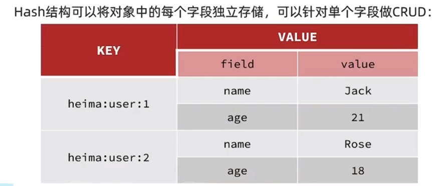
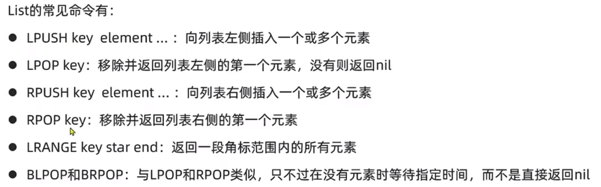
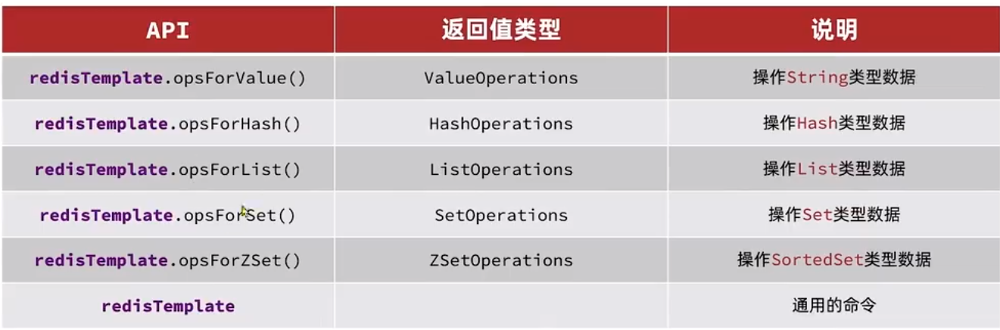

# Redi快速入门

## NoSQL

NoSQL全称是Not Only SQL 它是一种非关系型数据库，相比传统SQL关系型数据库:

* 不保证关系数据的ACID特性
* 并不遵循SQL标准
* 消除数据之间关联性

相对应关系数据库的优势：

* 远超传统关系型数据库的易于扩展
* 数据模型更加灵活
* 高可用

这样，NoSQL的优势一下就出来了，这不就是我们正要寻找的高并发海量数据的解决方案吗！

NoSQL数据库分为以下几种：

* **键值存储数据库：**所有的数据都是以键值方式存储的，类似于我们之前学过的HashMap，使用起来非常简单方便，性能也非常高。
* **列存储数据库：**这部分数据库通常是用来应对分布式存储的海量数据。键仍然存在，但是它们的特点是指向了多个列。
* **文档型数据库：**它是以一种特定的文档格式存储数据，比如JSON格式，在处理网页等复杂数据时，文档型数据库比传统键值数据库的查询效率更高。
* **图形数据库：**利用类似于图的数据结构存储数据，结合图相关算法实现高速访问。

其中我们要学习的Redis数据库，就是一个开源的**键值存储数据库**，所有的数据全部存放在内存中，它的性能大大高于磁盘IO，并且它也可以支持数据持久化，他还支持横向扩展、主从复制等。

实际生产中，我们一般会配合使用Redis和MySQL以发挥它们各自的优势，取长补短。

## 认识Redis

Redis是Remote Dictionary Server，远程词典服务器，是一个基于内存的键值型NoSQL数据库。Redis默认有16个数据库，从哦db0到db15

选择数据库：`select 0`或者 `select 1`
设置key/value : `set key keyzhi`
               `set  value valuezhi`
选择key/value： `get key` / `get value`

特征：

键值型，value支持不同的数据结构，功能丰富。

单线程，每个命令线程安全

延迟低，速度块（基于内存，io多路复用，良好的编码）

支持数据持久化。

支持主从集群，分片集群。

支持多语言客户端。

## Redis常见命令

查询所有key keys *

删除所有key flushall 或者 flushdb


### Redis数据结构

key一般是String类型，value的类型多种对样

String :  hello world
Hash :    {name: "jack",age: 21}
List:   [A -> B -> C]
set :   {A，B，C}
SoretSet {A:1，B：2,C：3}
GEO：{A:(123.3, 23.1)}
BitMap
HyperLog

#### 通用命令

通用命令是部分数据类型的，都可以使用的命令，常见的有：

* keys:查看符合模板的所有key `keys *`
  这样的模糊查询不建议使用。
* del: 删除一个指定的key `del name`，`del name1 name2`
* exists: 判断一个key是否存在。`exists name`存在返回1,不纯在返回0
* expire：给一个key设置有效期，到时就删除这个key。
  `expire name 20`20是秒
* TTL : 查看key还剩的有效时间，`ttl name`。显示-2为已经被删除，-1代表永久有效。

#### String类型

String类型，字符串类型，分为string，int,float。

最大不能超过512m。


##### key的结构

Redisd的key允许有多个单词形成层级结构，多个单词之间用 : 隔开，
    学校名:学院名：班级名：学号
eg: 项目里面有学校，不同学院和不同班级的学生
    `shool:computer:class194:019007040421`
    `shool:computer:class193:019007040421`

#### Hash类型

Hash类型，value是一个无序字典，类似Java中的HashMap

将通用命令前加一个H就算Hash的操作指令。
一个key可以有多个field，一个field对应一个value。
key为 shcol:class:194  field: name  value: lliyanjun
      shcol:class:193  filed: name value: zhangsan

#### List类型

Redis的List类型和Java中的LinkedList类似，是双向链表结构，支持正向检索也可以支持反向检索。

* 有序
* 元素可重复
* 插入和删除快
* 查询速度一般
  常用场景：朋友圈点赞，评论列表
  

#### Set类型

类似HashSet,

* 无序
* 元素不可重复
* 查找快
* 支持交集，并集，差集等功能。
  常用场景：关注列表。
  常见命令：
  SADD key member .. 向set中添加一个或者多个元素。
  `sadd key a b c d e`
  srem key member .. 移除set中指定元素。
  scard key .. 返回set中元素的个数
  sismember key member .. 判断一个元素是否存在于set中
  smembers 获取set中的所用元素
  sinter key1 key2 .. 求key1和key2的交集。
  sdiff key1 key2 .. 求key1和key2的差集。
  sunion key1 key2 .. 求key1和key2的并集。

练习：
下列数据用Redis的set集合来存储：
张三的好友有：李四，王五，赵六
李四的好友有：王五，麻子，二狗
利用Set的命令实现下列功能：
计算张三的好友有几个人：
`sadd zhangsan lisi wangwu zhaoliu`
`sadd lisi wangwu mazi ergou`
计算张三和李四有那些共同的好友
`sinter zhangsan lisi`
查询那些人三张三的好友却不算李四的好友
`sdiff zhangsan lisi`
查询张三和李四的好友共有那些人
`sunion zhangsan lisi`
判断李四是否三张三的好友
`sismember zhangsan lisi`
判断张三是否是李四的好友
`sismember lisi zhangsan`

#### SortedSet

与Java中的TreeSet有些类似。SortedSet底层每一个元素都带有一个score属性，可以基于score属性对元素排序，底层实现三一个跳表和hash表。
SortedSet比起Set，可排序，查询速度快。
常用场景：排行榜
使用方法：
zadd key score member .. 添加一个或者多个元素到sortedset，如果存在就更新其score值
zrem key member 删除sorted set中的一个指定元素
zscore key member 获取sorted set中的指定元素的score排名
zrank key member 获取sorted set中的指定元素的排名
zcard key 获取sorted set中的元素个数
zcount key min max 统计score值在给定范围内的所有元素的个数
zincrby key increment member 让sorted set中指定元素自增，步长为increment值
zrange key min max 按照score排序后，获取指定排名范围内的元素
zrangebyscore key min max 按照score排序后，获取指定score范围内的元素
zdiff，zinter,zunion 差，交，并集
所有排名都是默认升序，改为降序，在命令的z后添加rev

练习：
将下列存入SortedSet中
Jack 85,Lucy 89,Rose 82,Tom 95,Jerry 78,Amy 92,Miles 76
`zadd students 85 jack 89 Lucy 82 Rose 95 Tom 78 Jerry 92 Amy 76 Miles`
删除Tom同学
`zrem students Tom`
获取Amy同学的分数
`zscore students Amy`
获取Rose同学的排名
`zrank students Rose`
查询80分以下有几个学生
`zcount students 80 100`
给Amy同学加2分
`zincrby students 2 Amy`
查询成绩前3名的同学
`zrange students 1 3`
查询成绩80分以下的所有同学
`zrangebyscore students 80 100`

## Jedis

导入坐标
redis.clients
jedis
3.7.0
建立连接
`Jedis jedis = new Jedis("ip地址",端口号)`

Jedis是线程不安全的，频繁的创建和消耗会损耗性能，和数据库，多线程一样，使用连接池
JedisPoolCinfig是用来设定连接池的配置
`JedisPoolConfig jedisPoolConfig = new JedisPoolConfig(); `
JedisPool是用来连接Reids的
`JedisPool jedisPool = new JedisPool(jedisPoolConfig,"ip地址",端口号);`

## SpringDataRedis

SpringData是Spring中数据操作的模块，包括对各种数据库的集成，对Redis的集成叫SpringDataRedis。

* 提供了对不同的Redis客户端的整合
* 提供了RedisTemplate统一API来操作Redis
* 支持Redis的发布订阅模型
* 支持Redis哨兵和Redis集群
* 支持基于Lettuce的响应式编成
* 支持基于JDK，JSON，字符串，Spring对象的数据序列化和反序列化
* 支持基于Redis的JDKCollection实现

### 1.导入坐标

redis依赖
spring-boot-starter-data-redis
连接池依赖
commons-pool2

### 2.写配置文件

```yml
spring:
  redis:
    host: localhost
    port: 6379
    lettuce:
      pool:
        max-active: 8 #最大连接
        max-idle: 8 #最大空闲连接
        min-idle: 0 #最小空闲连接
        max-wait: 100 #连接等待时间
```

### 3.注入RedisTemplate

```java
@Autowired
private RedisTemplate redisTemplate
```

### 4.使用Redis

```java
// 插入一条string 类型数据
redisTemplate.opsForValue().set("name",李四);
//读取一条string类型数据
Object name = redisTemplate.opsForValue().get("name");
```

## RedisTemplate

SpringDataRedis中提供了RedisTemplate工具类，其中封装了各种对Redis操作。并且将不同数据类型的操作API封装不同的类型中;


### RedisTemplate的RedisSerializer

直接通过RedisTemplate传入redis的key和value，，在redis服务器中是被当成字节存储。原因是因为，ops的set方法，存入的都是java对象。默认是jdk序列化。

改变序列化的方式，使得我们的序列化对象是可读的。

1。创建一个配置类。

key的序列化是RedisSerializer.string，value的序列化是GenericJackson2JsonRedisSerializer

```java
@Configuration
public class RedisConfig {

    @Bean
    public RedisTemplate<String,Object> redisTemplate(RedisConnectionFactory connectionFactory){
        //创建RedisTemplate对象
        RedisTemplate<String, Object> template = new RedisTemplate<>();
        //设置连接工厂
        template.setConnectionFactory(connectionFactory);
        //创建JSON序列化工具
        GenericJackson2JsonRedisSerializer jsonRedisSerializer = new GenericJackson2JsonRedisSerializer();
        //设置key的序列化
        template.setKeySerializer(RedisSerializer.string());
        template.setHashKeySerializer(RedisSerializer.string());
        //设置value的序列化
         template.setValueSerializer(jsonRedisSerializer);
        template.setHashValueSerializer(jsonRedisSerializer);
        //返回
        return template;
    }
}
```

2.导入jackson坐标

```xml
<dependency>
    <groupId>com.fasterxml.jackson.core</groupId>
    <artifactId>jackson-databind</artifactId>
</dependency>
```

3.单元测试

```java
@SpringBootTest
class DemoApplicationTests {

    @Autowired
private RedisTemplate<String,Object> redisTemplate;

@Test
void contextLoads() {
        redisTemplate.opsForValue().set("test","钢铁侠");
Object name = redisTemplate.opsForValue().get("test");
System.out.println(name);
}

}
```

注意：如果在命令行客户端没有显示，还是字节的形式，就使用 redis-cli --raw

存入的value是对象类型的，可以序列化为json，顺便带了class属性，class属性是对象的路径。取value的时候，可以根据class属性将json自动反序列化为对象

## StringRedisTemplate

redisTemplate存入对象的时候因为class的属性而带来了额外的内存开销。

所以使用String序列化器来处理value和key，要求只能存储String类型的key和value。当需要存储java对象的时候，手动完成对象的序列化和反序列化。

```java
@SpringBootTest
class DemoApplicationTests {

    @Autowired
private StringRedisTemplate stringRedisTemplate;
//JSON工具
private static final ObjectMapper mapper = new ObjectMapper();

@Test
void contextLoads() throws JsonProcessingException {
        //准备对象
User user = new User("李焱军",23);
//手动序列化
String json = mapper.writeValueAsString(user);
//写数据到redis
stringRedisTemplate.opsForValue().set("user:200",json);
//读取数据
String val = stringRedisTemplate.opsForValue().get("user:200");
//反序列化
User user1 = mapper.readValue(val,User.class);
System.out.println(user1);
}

}
```

注意：对象的类一定要有无参构造。

### RedisTemplate操作Hash类型

```java
@Test
void testHash(){
    stringRedisTemplate.opsForHash().put("user:400","name","李测试1");
stringRedisTemplate.opsForHash().put("user:400","age","12");

Map<Object, Object> entries = stringRedisTemplate.opsForHash().entries("user:400");
System.out.println(entries);

Object name = stringRedisTemplate.opsForHash().get("user:400", "name");
System.out.println(name);

}
```
